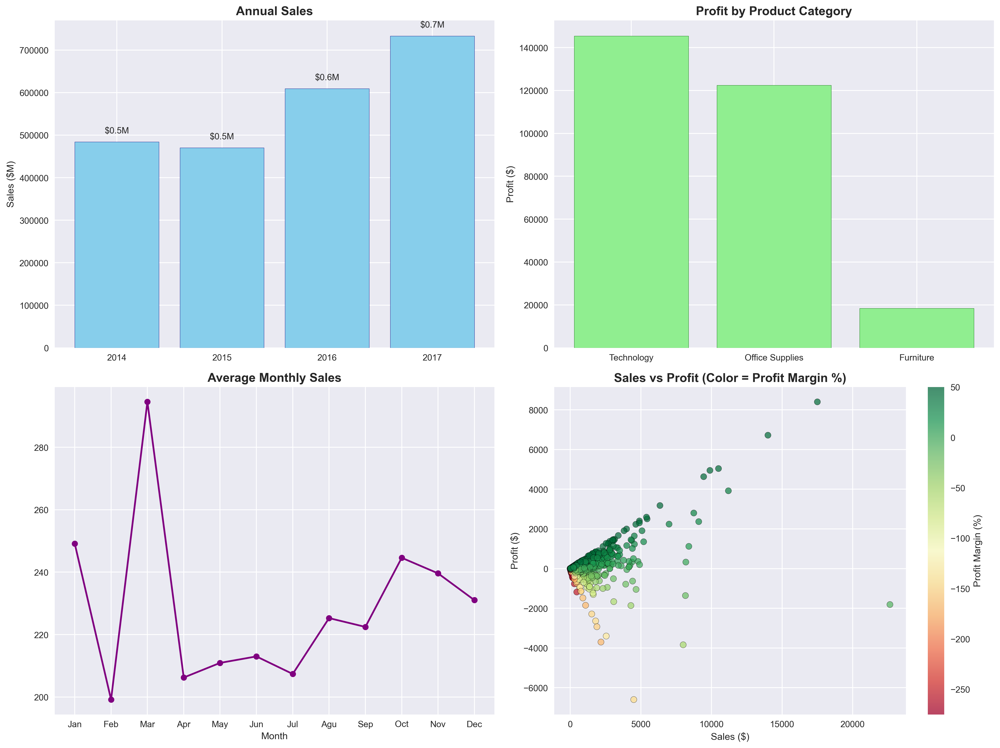

# Superstore Sales Analysis



## Project Goal
Analyze 4 years of US superstore sales data (2014–2018) using **Pandas** and **Matplotlib** to answer key business questions:

- Annual sales trend?
- Most profitable product category?
- Peak sales months?
- Are high-value orders always profitable?

---

## Dataset
- **Source**: [Kaggle – Superstore Sales](https://www.kaggle.com/datasets/bhanupratapbiswas/superstore-sales)
- **Records**: 9,994 orders
- **Key Columns**: `Sales`, `Profit`, `Quantity`, `Discount`, `Order Date`, `Category`

---

## Key Insights
| Insight                        | Finding                                      |
|-------------------------------|-----------------------------------------------|
| Most Profitable Category      | Technology                                    |
| Peak Sales Months             | November & December                           |
| 4-Year Sales Growth           | +38% (2014 → 2018)                            |
| Profitability Risk            | Orders > $2,000 can be loss-making (negative margin) |

---

## Tools & Technologies
- Python
- Pandas, Matplotlib, Seaborn
- Jupyter Notebook

---

## Project Structure

---

## How to Run
```bash
# 1. Clone the repo
git clone https://github.com/artininsight/superstore-sales-analysis.git
cd superstore-sales-analysis

# 2. Install dependencies
pip install -r requirements.txt

# 3. Launch notebook
jupyter notebook notebooks/analysis.ipynb
